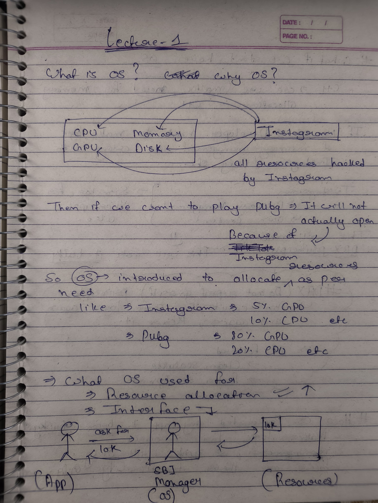
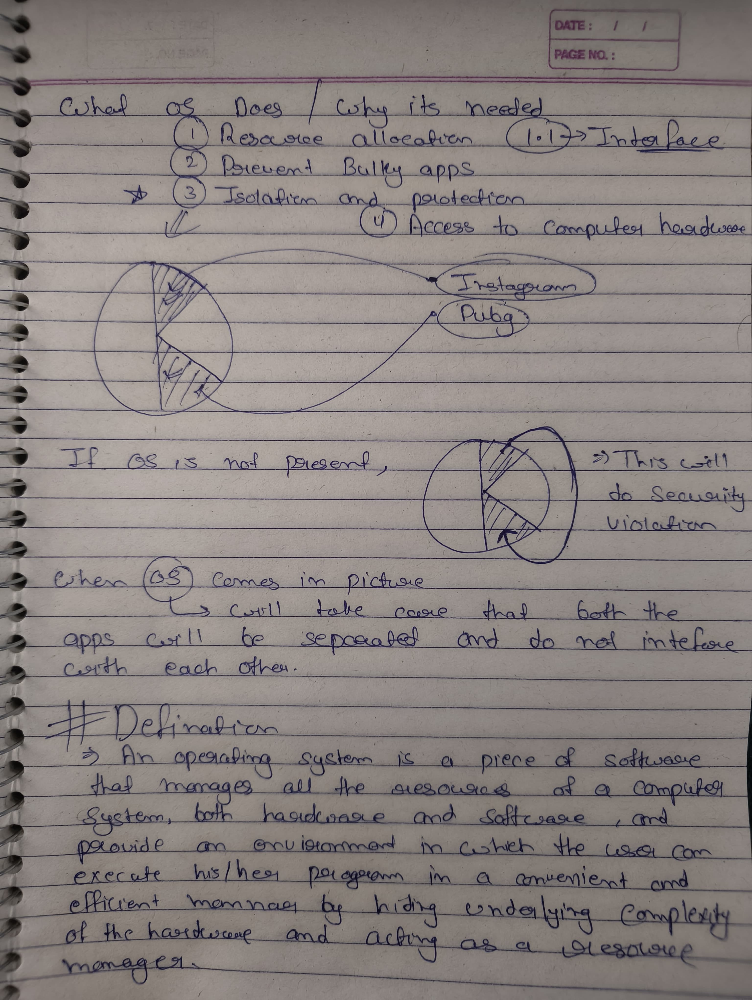
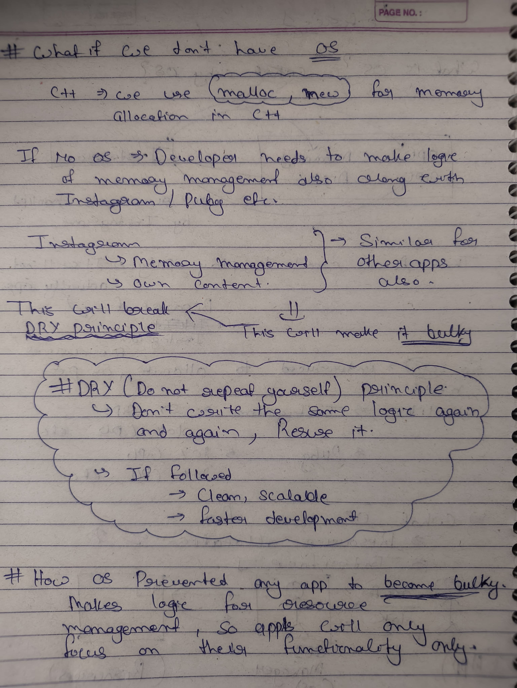

# Operating Systems Notes

## Chapter 1

### Topics Covered

- What is Operating System
- Resource Allocation (CPU, Memory, Disk)
- Memory Management
- DRY Principle (Don't Repeat Yourself)
- Why OS is needed

### Key Learnings

- OS manages system resources efficiently
- Prevents applications from becoming bulky
- Ensures isolation between applications
- Provides abstraction over hardware

### Notes

